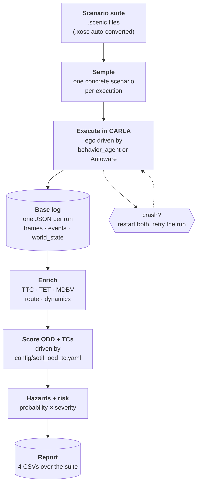

# SAFE-SCoRE

**A SOTIF-compliant framework for executing and scoring driving scenario suites in CARLA.**

SAFE-SCoRE executes a suite of driving scenarios in CARLA and turns every
execution into SOTIF evidence: safety-criticality metrics, ODD and
triggering-condition scoring, hazard and residual-risk estimates, and a report
over the whole suite.

The ego vehicle can be driven either by CARLA's built-in agent or by a real
autonomous driving stack (**Autoware**), so the same scenario suite can be used
to evaluate an actual system under test.

---

## Why

Running a scenario and watching what happens is easy. Turning many executions
into evidence you can defend is not, and that is the gap this tool fills.

Three things make it hard, and SAFE-SCoRE handles each of them:

- **A scenario is not one situation.** Scenic scenarios describe *distributions*
  of parameters. Executing one once tells you almost nothing, so SAFE-SCoRE
  re-samples every execution and aggregates across runs.
- **Evidence must be standardised.** Ad-hoc logging per experiment cannot be
  compared or reviewed. Every execution here produces the same log schema and
  the same metrics, derived from [ISO 21448
  (SOTIF)](https://www.iso.org/standard/77490.html) concepts: ODD, triggering
  conditions, hazards, residual risk.
- **The environment is unreliable.** CARLA and Autoware both crash under load.
  A campaign that silently loses runs produces invalid statistics, so the
  runner detects failures, restarts both, and retries.

What the scenarios *came from* is deliberately out of scope. Any suite works,
whether hand-written, generated, or converted from OpenSCENARIO. Comparing
generators is one possible use of the output, not the purpose of the tool.

---

## How it works



All of this is **one command**. `src/runner/` runs each scenario *n* times and
writes one base log per run; the evaluation then enriches those logs and writes
the report, automatically, into the same folder. You do not run a second step.

The two stages are nonetheless independent, so logs produced by another tool can
be fed straight into the evaluation (see
[docs/integration.md](docs/integration.md)).

> **Future work.** A further stage, comparing *different suites* against each
> other, is envisioned but not part of the tool yet.

---

## Metrics

### Per execution

Computed for every run and written back into its log under `results` and
`sotif`.

| Metric | Meaning |
|---|---|
| `min_TTC` | Smallest time-to-collision reached during the run. Lower is more critical. |
| `TET_total` | Total time spent below the critical TTC threshold (Time Exposed TTC). |
| `TET_max` | Longest single continuous stretch below that threshold. |
| `MDBV` | Minimum distance between the ego's bounding box and any other actor's over the run. |
| `MDBV_actor`, `min_TTC_actor` | Which actor produced the worst case, and at which frame. |
| `performance` | Route completion: whether the planned route was completed, distance travelled vs planned, and path-deviation statistics (mean / RMSE / MAE / max / std). |
| `mean_speed`, `max_speed` | Ego speed over the run. |
| `mean_long_acc`, `p95_long_acc`, `max_long_acc` | Longitudinal acceleration, as a driving-style indicator. |
| `event_counts` | Counted safety events: collisions (vehicle / pedestrian / static), red light, stop sign, speeding, lane invasion, off-road. |
| `odd_env`, `odd_infra`, `odd_traffic`, `odd_operational` | ODD scores per category (environment, infrastructure, traffic, operational). |
| `odd_global` | The four category scores averaged into one ODD score for the run. |
| `odd_values` | The categorical bucket chosen for each ODD factor (e.g. weather preset, time of day, traffic density). |
| `triggering_conditions` | Which declared triggering conditions fired in this run. |

### Suite report

Four CSVs written into the run's output folder.

| File | Contents |
|---|---|
| `SOTIF_Final.csv` | One row per scenario. For each of the 7 hazard types: **HR** (hazard rate), **R** (residual risk), **S** (severity). Plus `HR_avg`, `R_avg`, mean execution time, `completed_runs` and `completion_rate`. |
| `sotif_hazard_leaderboard.csv` | Scenarios ranked by risk. For each hazard type: **P** (probability of occurrence), **S** (severity), **R** (residual risk = P × S). Flags each scenario against `acceptance_threshold` via `is_non_acceptable`. |
| `odd_scores.csv` | Per-scenario ODD scores by category and overall, the ODD values observed, and the triggering conditions that fired. |
| `odd_tc_coverage_{all,non_acceptable}.csv` | How much of the declared ODD/TC space the suite actually exercised: `declared_values` vs `observed_values`, `coverage`, and `entropy_norm` (how evenly the observed values were spread). The `non_acceptable` variant restricts this to scenarios that exceeded the risk threshold. |

The 7 hazard types are: collision with pedestrian, collision with vehicle,
collision with static object, red-light violation, stop-sign violation,
off-road, lane invasion.

The ODD factors, triggering conditions and the acceptance threshold are **not
hardcoded** — they are declared in
[`config/sotif_odd_tc.yaml`](config/sotif_odd_tc.yaml). Pointing the framework
at a different system under test means editing that file, not the code. See
[docs/enrichment.md](docs/enrichment.md).

---

## Requirements

| | |
|---|---|
| **Python** | 3.10 |
| **OS** | Windows or Ubuntu 22.04 |
| **CARLA** | 0.9.15 |
| **Autoware** | 1.8.0 on ROS 2 Humble — *only for `--engine autoware`* |
| **Scenic** | 3.2.0b1, installed from source (see below) |
| **GPU** | NVIDIA, for CARLA rendering |

`--engine behavior_agent` needs only CARLA. Autoware and the bridge are needed
only to drive the ego with a real AD stack.

---

## Part 1 — CARLA, Autoware and the bridge

Follow the guide in the
[**univaq-avv-carla-autoware**](https://github.com/CarlinoCalogero/univaq-avv-carla-autoware)
repository **until Step 10 "Run"**, which covers installing CARLA, Autoware and the
`autoware_carla_interface` bridge.

Four things that guide does not cover, and that you will need:

### 1. Check out Autoware 1.8.0

The guide's instructions match tag `1.8.0`; on newer revisions
`setup-dev-env.sh` has been removed and the guide no longer applies.

```bash
cd ~/autoware
git checkout 1.8.0
```

### 2. If the build fails on a TensorRT header

`colcon build` can fail in `autoware_tensorrt_common` because CUDA is not on
`PATH` — the package then warns and installs nothing, and the failure surfaces
later as a missing header. If your error looks like that, put CUDA on `PATH`
and rebuild:

```bash
export PATH=/usr/local/cuda/bin:$PATH
cd ~/autoware && colcon build --symlink-install --cmake-args -DCMAKE_BUILD_TYPE=Release
```

### 3. Fix the launch include path

`autoware_launch` looks for the bridge launch file without the `launch/`
directory, while `autoware_universe` installs it into `launch/`. The two
disagree and the launch aborts with `FileNotFoundError`. In
`autoware_launch/launch/e2e_simulator.launch.xml`:

```xml
<!-- was -->
<include file="$(find-pkg-share autoware_carla_interface)/autoware_carla_interface.launch.xml"/>
<!-- now -->
<include file="$(find-pkg-share autoware_carla_interface)/launch/autoware_carla_interface.launch.xml"/>
```

### 4. Apply the tick patch — required

CARLA in synchronous mode advances only when a client sends a *tick*, and
**exactly one client may tick**. By default the bridge ticks; SAFE-SCoRE must,
because it also drives the NPCs. Two tick masters double-step the world and
silently corrupt every time-based metric.

In `autoware_carla_interface/src/autoware_carla_interface/carla_autoware.py`,
add `import os` and make the tick conditional:

```python
# was:
if self.running:
    CarlaDataProvider.get_world().tick()

# now:
if self.running and os.environ.get("CARLA_EXTERNAL_TICK") != "1":
    CarlaDataProvider.get_world().tick()
```

No rebuild needed (the package is symlink-installed). With the variable unset,
stock Autoware behaviour is unchanged.

**Expected consequence:** with `CARLA_EXTERNAL_TICK=1`, Autoware cannot finish
its own startup unaided — it needs ticks to spawn its ego and sensors. It will
start, print nothing, and no car will appear until something ticks the world.
SAFE-SCoRE does that automatically. This is not a fault.

> **Town05 note — required.** With Autoware attached, CARLA 0.9.15 on Town05
> dies within a couple of ticks with **two or more RGB cameras** enabled. Leave
> exactly one: the front camera.

Comment out every camera except `CAM_FRONT` in the bridge's sensor mapping:

```bash
cd ~/autoware/src/universe/autoware_universe/simulator/autoware_carla_interface/config
cp sensor_mapping.yaml sensor_mapping.yaml.backup
sed -i -E '/- CAM_FRONT\/camera_link/! s|^(\s*)- (CAM_[A-Z_]*\/camera_link)|\1#  - \2|' sensor_mapping.yaml
```

Check the result:

```bash
grep -A13 "^enabled_sensors:" sensor_mapping.yaml
```

It must look like this — only `CAM_FRONT` uncommented, LiDAR/IMU/GNSS
untouched:

```yaml
enabled_sensors:
  # LiDAR
  - velodyne_top_base_link

  # Cameras (6 for 360-degree coverage)
  - CAM_FRONT/camera_link
  #  - CAM_FRONT_LEFT/camera_link
  #  - CAM_FRONT_RIGHT/camera_link
  #  - CAM_BACK/camera_link
  #  - CAM_BACK_LEFT/camera_link
  #  - CAM_BACK_RIGHT/camera_link

  # IMU and GNSS
  - tamagawa/imu_link
  - gnss_link
```

No rebuild is needed. To undo: `cp sensor_mapping.yaml.backup sensor_mapping.yaml`.

**Consequence to record in any results:** with a single camera, Autoware's
traffic-light recognition is degraded. Red-light metrics collected in this
configuration should not be trusted without checking.

Once installed, day-to-day startup is covered by
[**docs/DAILY_PROCEDURE.md**](docs/DAILY_PROCEDURE.md).

---

## Part 2 — SAFE-SCoRE

### 1. Virtual environment

```bash
# Windows
py -3.10 -m venv safe_score
safe_score\Scripts\activate

# Ubuntu
python3.10 -m venv safe_score
source safe_score/bin/activate
```

**From now on, stay in the virtual environment.**

### 2. Scenic, from source

Scenic must be installed from its repository, not from PyPI. SAFE-SCoRE is
developed against **3.2.0b1**.

```bash
python -m pip install --upgrade pip
cd /path/to/where/you/keep/repos
git clone https://github.com/BerkeleyLearnVerify/Scenic
cd Scenic
python -m pip install -e .
```

### 3. Dependencies

```bash
cd /path/to/SAFE-SCoRE
pip install -r requirements.txt
```

Scenic is intentionally absent from `requirements.txt` — it is installed above.

---

## Part 3 — Running

Run everything from the repository root, with the virtual environment active.

### Mode 1 — CARLA only

The ego is driven by CARLA's built-in `behavior_agent`. Autoware is not
involved.

**Step 1.** Start CARLA, or let SAFE-SCoRE start it (below).

**Step 2.** Run the suite:

```bash
python -m src.runner.run_experiment --input_dir scenic_example/suite --output_folder my_run --num_runs 10
```

To have SAFE-SCoRE launch, restart and shut down CARLA itself, add:

```bash
  --carla_exe "C:\path\to\CARLA_0.9.15\WindowsNoEditor\CarlaUE4.exe" --carla_launch_args="-prefernvidia -quality-level=Low"
```

### Mode 2 — CARLA + Autoware

The ego is driven by Autoware. Scenic still controls the NPCs.

**Step 1 — required, once per WSL session.** Autoware's DDS layer needs kernel
and network settings that **do not survive a WSL restart**, and applying them
needs `sudo`, so the pipeline cannot do it for you. In an Ubuntu (WSL) terminal:

```bash
sudo ip link set lo multicast on
```

```bash
sudo sysctl -w net.core.rmem_max=2147483647
```

```bash
sudo sysctl -w net.ipv4.ipfrag_time=3
```

```bash
sudo sysctl -w net.ipv4.ipfrag_high_thresh=134217728
```

Check they applied — if `rmem_max` still reads a small number, they did not:

```bash
sysctl -n net.core.rmem_max && ip link show lo | grep -o MULTICAST
```

Skip this and Autoware **will not start at all**. The failure is not obvious
from the runner's log, which reports only `pre-flight: Autoware nodes are
missing`; launching Autoware by hand shows the real cause:

```
selected interface "lo" is not multicast-capable: disabling multicast
[rmw_cyclonedds_cpp]: rmw_create_node: failed to create domain
[launch]: error creating node: rcl node's rmw handle is invalid
```

**Leave that Ubuntu terminal open for the whole session.** WSL shuts its VM down
when you run `wsl --shutdown`, when Windows reboots, **and when you close every
Ubuntu terminal and leave it idle for a few minutes**. If the VM stops, these
settings are gone and Autoware stops launching again — so keep one terminal
open until you are finished.

Paste the four `sysctl` commands **one line at a time**. Pasting them as a
single `&&` chain can be split across lines by the terminal, which silently
runs the fragments as separate commands and leaves most settings unapplied.

**Step 2.** Nothing else needs to be running — SAFE-SCoRE starts CARLA and
Autoware itself. Make sure neither is already up.

**Step 3.** Run the suite:

```bash
python -m src.runner.run_experiment --input_dir scenic_example/suite --output_folder my_run --num_runs 10 --engine autoware --follow_camera behind --carla_exe "C:\path\to\CARLA_0.9.15\WindowsNoEditor\CarlaUE4.exe" --carla_launch_args="-prefernvidia -quality-level=Low" --autoware_map_path /home/<your-linux-user>/autoware/autoware_map/Town05
```

> **Give `--autoware_map_path` as a literal Linux path.** Writing `"$HOME/..."`
> in PowerShell expands it to your *Windows* home before it reaches WSL;
> Autoware then starts with no map and localization fails much later with
> `align server failed`. The runner checks the path exists inside WSL and stops
> immediately if it does not.

RViz opens by itself. Before any run, a **pre-flight** check verifies that the
simulation clock is sane, that no stale ROS nodes remain and that exactly one
bridge is running. Nothing executes until it passes.

### Re-running the evaluation on its own

Both modes above already produce the full report. Use this only to re-evaluate
logs you already have — after editing `config/sotif_odd_tc.yaml`, or on logs
produced by another tool:

```bash
python -m src.pipeline.run_pipeline --output_folder my_run
```

Add `--all` instead to evaluate every folder under `outputs/`.

### Options

| Flag | Default | Purpose |
|---|---|---|
| `--input_dir` | — | Folder of `.scenic` / `.xosc` scenarios (searched recursively) |
| `--output_folder` | — | Results land in `outputs/<name>/` |
| `--num_runs` | 10 | Executions per scenario |
| `--engine` | `behavior_agent` | `behavior_agent` or `autoware` |
| `--max_run_attempts` | 5 | Retries of a failed run before the scenario is discarded |
| `--max_wall_seconds` | 300 | Wall-clock cap per execution |
| `--follow_camera` | off | `behind`, `top` or `front` — chase camera on the ego |
| `--carla_exe` | — | Let SAFE-SCoRE manage the CARLA server |
| `--autoware_map_path` | — | Map for Autoware; required for `--engine autoware` |
| `--skip_enrichment` | off | Execute scenarios only, skip the evaluation half |

### Watching a run

`--follow_camera behind` makes CARLA's spectator camera chase the ego for the
whole suite. It needs a CARLA window, so do **not** pass `-RenderOffScreen`.
Rendering a window costs performance: measured at ~46 s per run instead of
~30 s.

---

## Failure handling

CARLA and Autoware are both unstable under sustained load. See
[docs/KNOWN_INSTABILITIES.md](docs/KNOWN_INSTABILITIES.md) for the failure
modes, each with the evidence that established it.

When either side fails, SAFE-SCoRE:

1. Stops and restarts **both** — never one. A CARLA crash strands Autoware on a
   dead connection, and restarting Autoware against a live CARLA makes it
   reload a map CARLA already has, which crashes the engine.
2. Re-runs the pre-flight check.
3. Retries the **same** run, up to `--max_run_attempts` times.
4. Discards the scenario if the attempts are exhausted, and moves to the next.

A summary of completed and discarded scenarios is printed at the end. The same
policy applies in both engine modes.

---

## Output

One invocation produces everything below, in `outputs/<output_folder>/`, and
touches no other result folder:

```
outputs/my_run/
  <scenario>_run_01_log_basic.json     one per execution, enriched in place
  SOTIF_Final.csv
  sotif_hazard_leaderboard.csv
  odd_scores.csv
  odd_tc_coverage_all.csv
  odd_tc_coverage_non_acceptable.csv
```

The log schema is documented in [docs/base_log_json.md](docs/base_log_json.md).

---

## Repository layout

```
src/runner/              scenario execution, CARLA/Autoware lifecycle, recovery
src/converter/           OpenSCENARIO (.xosc) -> Scenic
src/data_gathering/      logging during a run, and metric enrichment after it
src/pipeline/            the SOTIF evaluation pipeline
src/analysis/            cross-suite comparison (future work, not part of a run)
config/                  ODD / triggering-condition declarations
maps/                    Town05 OpenDRIVE map used by the scenarios
scenic_example/          example scenario suites
outputs/                 results, one folder per invocation
docs/                    detailed documentation
```

---

## Documentation

| Document | What it covers |
|---|---|
| [ARCHITECTURE.md](ARCHITECTURE.md) | How the components fit together |
| [docs/DAILY_PROCEDURE.md](docs/DAILY_PROCEDURE.md) | Starting and stopping the environment day to day |
| [docs/sotif_pipeline.md](docs/sotif_pipeline.md) | The evaluation pipeline, step by step |
| [docs/enrichment.md](docs/enrichment.md) | How each metric is computed, and the ODD/TC config |
| [docs/base_log_json.md](docs/base_log_json.md) | Base log JSON schema |
| [docs/integration.md](docs/integration.md) | Feeding logs from another scenario tool into the evaluation |
| [docs/KNOWN_INSTABILITIES.md](docs/KNOWN_INSTABILITIES.md) | CARLA and Autoware failure modes, with evidence |
| [docs/LESSONS_LEARNED.md](docs/LESSONS_LEARNED.md) | What the failures taught |
| [docs/analysis_pipeline.md](docs/analysis_pipeline.md) | Cross-suite comparison — future work, never run by the pipeline |
